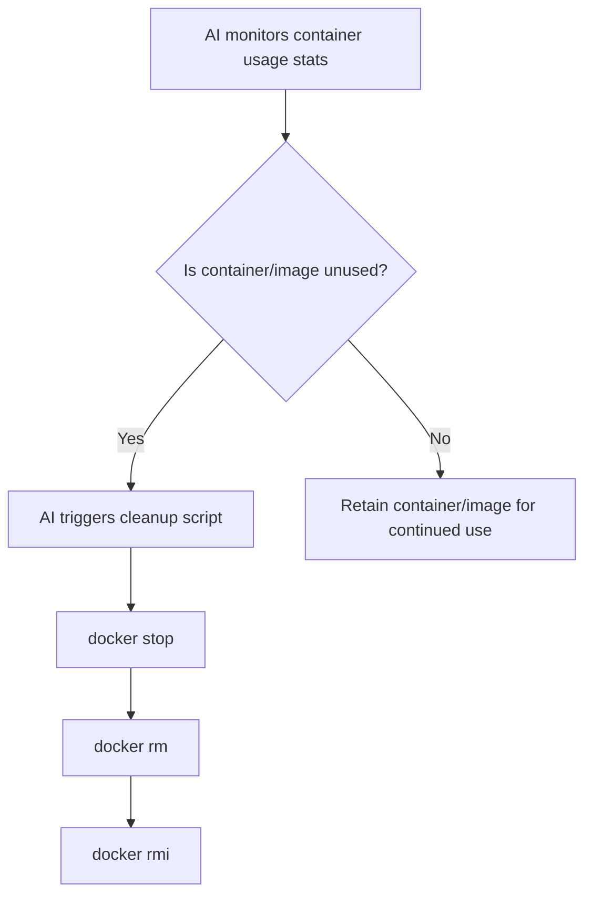

# 🤖 AI-Powered Docker Image & Container Automation

A developer-focused walkthrough and real-world case study showing how AI automates the lifecycle of Docker containers and images—from creation and orchestration to removal—using real industry workflows.

---

## 📌 Overview

Modern DevOps teams and AI-powered development platforms are increasingly using artificial intelligence to automate Docker operations like:

* Pulling base images intelligently
* Creating optimized Dockerfiles
* Building and tagging new images
* Deploying containers via pipelines
* Cleaning up unused containers/images

This README includes:

* AI automation flow diagrams in **Mermaid**
* Examples from **GitHub Actions**, **Azure DevOps**, and **GitHub Copilot**

---

## 🧠 Real-World Use Case: AI in GitHub + Azure DevOps

A developer commits code to a repository. AI-enhanced tooling then:

1. Detects the language and dependencies
2. Selects or suggests the appropriate Docker base image
3. Generates or modifies a Dockerfile
4. Builds and tags the image
5. Pushes it to a container registry (e.g., GHCR, Docker Hub, Azure CR)
6. Deploys the container to a service
7. Monitors usage and auto-removes unused containers/images

---

## 📦 Mermaid Diagram: AI-Based Image Creation Workflow

```mermaid
flowchart TD
  A[Developer pushes code to GitHub] --> B[AI detects language/framework]
  B --> C[AI suggests base image (e.g., python:3.11)]
  C --> D[AI generates Dockerfile via prompt/intent]
  D --> E[CI/CD builds image using Docker]
  E --> F[Image is pushed to registry (e.g., GHCR, Docker Hub)]
  F --> G[AI triggers deployment workflow]
  G --> H[Image runs in containerized environment]
```

---

## 🗑️ Mermaid Diagram: AI-Based Image & Container Cleanup



---

## 🧪 Prompt Engineering Example (GitHub Copilot)

**Prompt:**

> "Create a Dockerfile that runs a Node.js app on port 3000 using an Alpine base."

**Output:**

```Dockerfile
FROM node:18-alpine
WORKDIR /app
COPY . .
RUN npm install
EXPOSE 3000
CMD ["npm", "start"]
```

This file can be automatically included in CI/CD pipelines that are triggered by pushes or merges to `main` or `dev` branches.

---

## 🔄 Real Workflow Example: GitHub Actions + Azure CR

```yaml
name: Build and Deploy AI-Detected Image

on:
  push:
    branches: [main]

jobs:
  build-and-deploy:
    runs-on: ubuntu-latest
    steps:
      - name: Checkout code
        uses: actions/checkout@v3

      - name: Generate Dockerfile with Copilot (manual or precommitted)
        run: echo "FROM python:3.11-slim\nCOPY . .\nRUN pip install -r requirements.txt\nCMD [\"python\", \"app.py\"]" > Dockerfile

      - name: Build image
        run: docker build -t myapp:latest .

      - name: Login to Azure
        uses: azure/login@v1
        with:
          creds: ${{ secrets.AZURE_CREDENTIALS }}

      - name: Push to Azure Container Registry
        run: |
          az acr login --name myacr
          docker tag myapp:latest myacr.azurecr.io/myapp:latest
          docker push myacr.azurecr.io/myapp:latest
```

---

## 📊 Monitoring + Removal

Platforms like Azure DevOps and Kubernetes can use AI-driven telemetry to:

* Identify stale containers
* Auto-scale deployments
* Clean up unused Docker layers with retention policies

This reduces storage cost, improves performance, and supports green computing goals.

---

## ✅ Summary

AI is no longer futuristic in DevOps—it’s already here.

AI-powered workflows:

* Replace manual image selection
* Speed up Dockerfile creation
* Automate image builds and pushes
* Enable smart monitoring and cleanup

With tools like GitHub Copilot, Azure Pipelines, and GitHub Actions, developers can now **focus on app logic** while **AI handles the infrastructure plumbing.**

---

> 💬 Questions? PRs welcome. Want to contribute your AI + Docker use case? [Open an issue](https://github.com/your-repo/issues).
